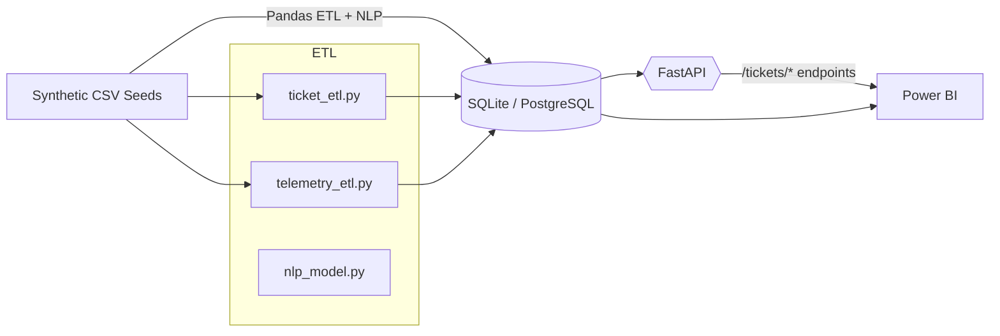

# Customer Support Ticket Intelligence & Product Telemetry Dashboard

Enterprise-grade analytics stack that simulates Cohesity-style support tickets, enriches them with NLP, stores results in SQL, and exposes insights through a FastAPI layer ready for Power BI dashboards.

## Architecture


## Features
- **Synthetic Data Factory** generating 1.5k tickets & 7.5k telemetry events.
- **NLP Enrichment** via spaCy rules + HuggingFace sentiment.
- **SQL Warehouse** with tickets, ticket_nlp, telemetry, and summary tables.
- **REST API** exposing top categories, sentiment mix, trends, and telemetry feeds.
- **Power BI Playbook** for hybrid DB + API visuals plus DAX recipes.
- **Docker & Tests** for reproducible deployment and quick validation.

## Folder Overview
```
support-analytics/
├── api/                # FastAPI app, routers, schemas
├── data/               # Raw + processed CSV + SQLite DB
├── database/           # SQLAlchemy models & init script
├── docker/             # Container + compose
├── etl/                # Ticket + telemetry pipelines and NLP helpers
├── notebooks/          # Placeholder notebook guidance
├── powerbi/            # Dashboard instructions & DAX
├── tests/              # Lightweight pytest coverage
├── config.py           # Central settings helper
├── env.example         # Copy to .env for customization
└── requirements.txt
```

## Quickstart
```bash
python -m venv .venv
source .venv/bin/activate  # or .venv\Scripts\activate on Windows
pip install -r requirements.txt
cp env.example .env        # optional overrides
```

## Run the ETL Pipelines
```bash
python etl/ticket_etl.py --generate-raw --records 1800
python etl/telemetry_etl.py --generate-raw --records 8000
python database/init_db.py
```
Outputs land in `data/processed/` and hydrate the SQLite DB automatically.

## Launch the API
```bash
uvicorn api.main:app --reload --port 8000
```
Swagger UI: `http://localhost:8000/docs`

Key endpoints:
- `GET /api/tickets/top-categories`
- `GET /api/tickets/sentiment-summary`
- `GET /api/tickets/trends`
- `GET /api/telemetry/events?product=Cohesity%20DataProtect&severity=High&timeframe=7`

## Power BI Dashboard
1. Follow `powerbi/instructions.md` to connect to SQLite + REST endpoints.
2. Build visuals: ticket trends, sentiment KPIs, category pie, telemetry spike chart, AI summary.
3. Drop the provided DAX calculations into your model for MoM tracking and resolution KPIs.
4. Replace screenshot placeholders under `powerbi/images/` with exports from your dashboard.

## Dockerized Workflow
```bash
cd docker
docker compose up --build
```
The container runs ETL, populates the DB, and starts FastAPI on `localhost:8000`.

## Tests
```bash
pytest
```

## Recruiter-Friendly Highlights
- Demonstrates **end-to-end ownership**: data generation → NLP → warehousing → API → BI.
- Uses **production-grade patterns**: SQLAlchemy models, dependency-injected FastAPI, logging, env-based configs.
- Ready for demos: Power BI instructions, Docker packaging, and storytelling README.
